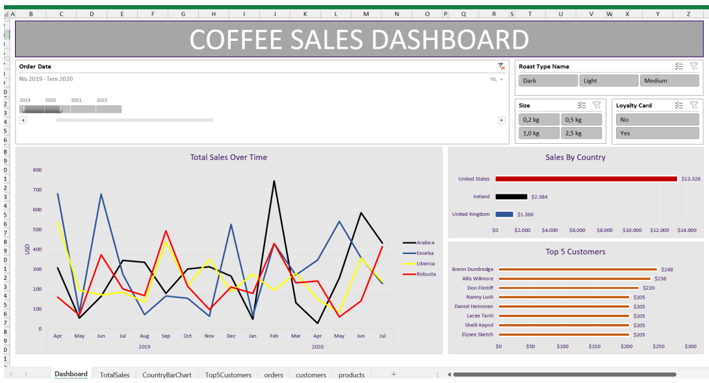

# Excel Dashboard Project

This project consists of three sheets: orders, customers and products. First, we add data to the customer name, email, country and coffee type columns in the orders sheet with the XLOOKUP formula. Then, we add data to the roast type, size, unit price columns with the INDEX MATCH formula. We use the multiplication formula for the sales column. We edit the order date data with date formatting. We also add the currency by editing the data in the unit price and sales column with number formatting. Before converting our data into a table, we check it with the duplicates method and turn the data into a table.We obtain our pivot tables and pivot charts from the tabular data. We organize our line chart with formatting. We show the coffee data by months with insert timeline, then add loyalty card, roast type name and size sections with insert slicers and edit the loyalty card data with orders. We add it to the p column of the table and use the XLOOKUP formula here. We combine the data into a new sheet for the Dashboard.

## The Goal of The Project

The aim of this project is to create a dashboard that can quickly and effectively show a business that has data such as the amount of coffee it sells, the information of the people who buy the coffee, and how much coffee it sells to whom and when, and what sizes of coffee it sells.

## Roadmap and Formulas

        XLOOKUP
        INDEX MATCH
        Multiple IF functions
        Date Formatting
        Number Formatting
        Check For Duplicates
        Convert Range to Table
        Pivot Tables and Pivot Charts + Formatting
        Insert Timeline + Formatting
        Insert SlicerXLOOKUP
        INDEs + Formatting
        Updating the Pivot Table Data Source
        Building the Dashboard

## Dataset 

You can find dataset in the project file.

## Website

For more information about the project, visit my website (https://www.sametyolcu.com/portfolio).
